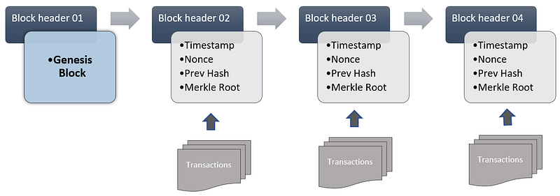
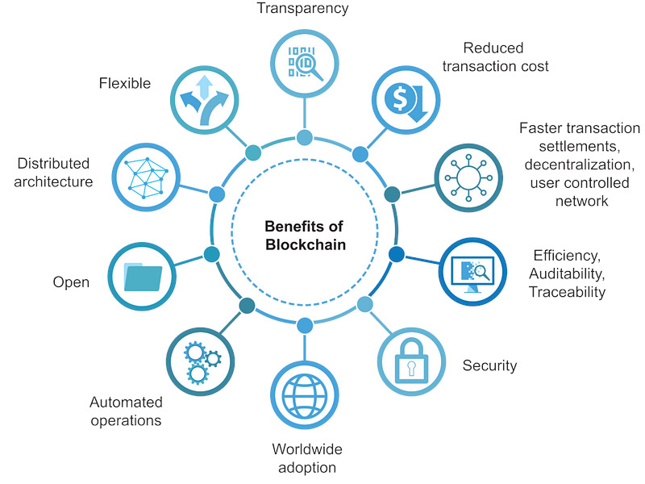
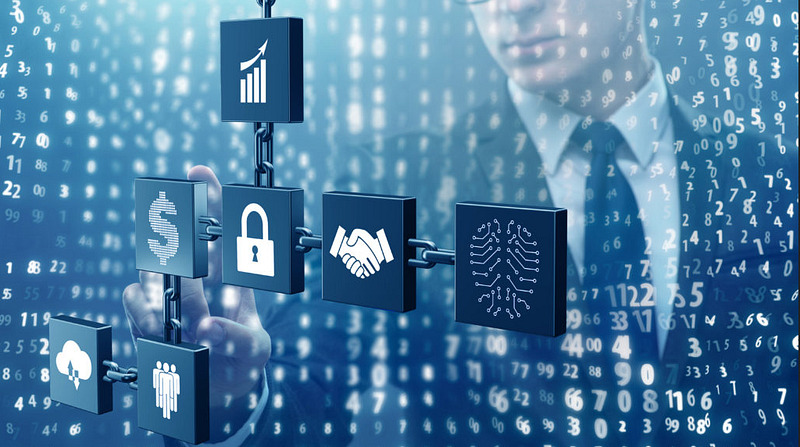
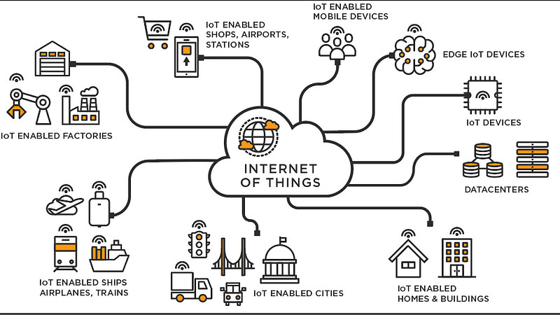
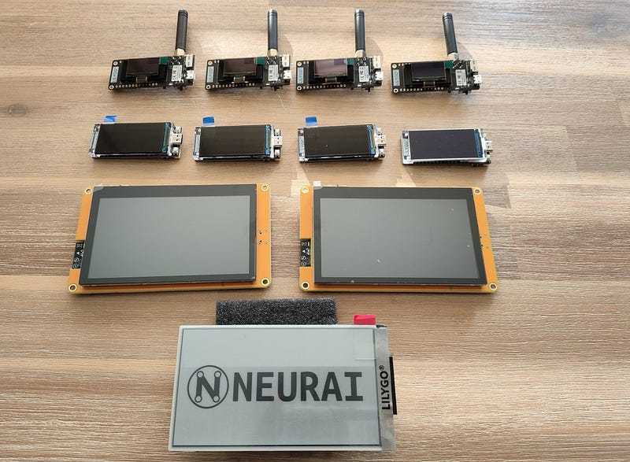
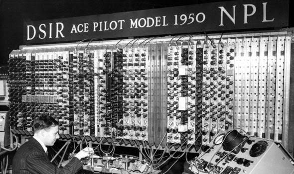
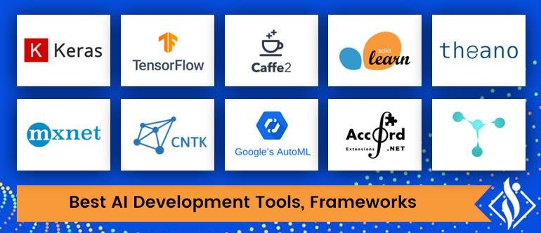
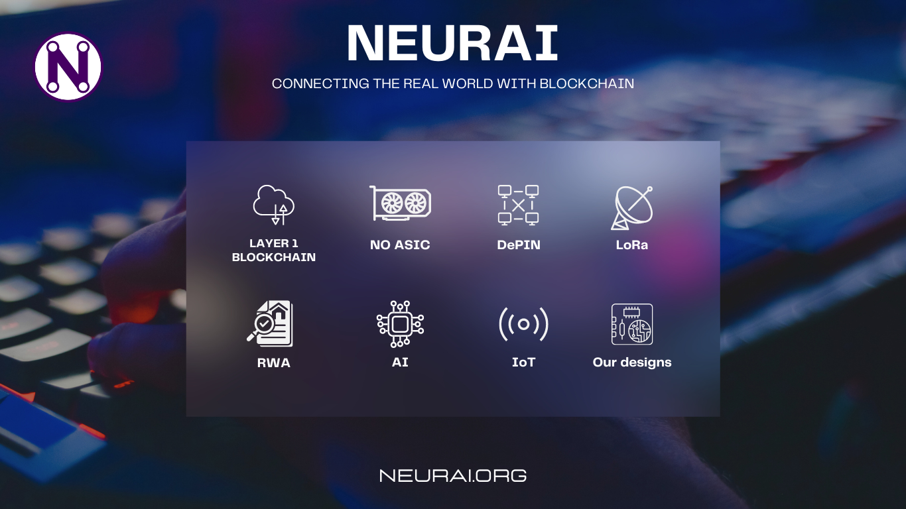

# Introduction

The inception of Neurai stems from the pursuit of an ecosystem where anyone can create low-power IoT devices, harness AI systems, and leverage blockchain to ensure the integrity of the information obtained or using this information to manage Assets in the form of Tokens or NFT.

For this purpose we have three important parts that together are of incalculable value: Blockchain + IoT + AI

Blockchain is a decentralized and distributed digital ledger technology where transactions are recorded across multiple computers linked in a peer-to-peer network. The name “blockchain” stems from its structure, wherein individual records, called “blocks,” are linked together in a single list, called a “chain.”

Each block contains information about transactions, like the date, time, and participants. What makes it revolutionary is that it’s nearly impossible to change, hack, or cheat the system. Once a block is added to the chain, it’s there for good.

## Blockchain — Why is Important?

Blockchain technology offers significant advantages, including:

- Decentralization: Unlike traditional transactions managed by central banks or government, blockchain doesn’t need intermediaries. The peer-to-peer network manages the transactions and data sharing, which eliminates the risk of centralization.
- Transparency: Every action is recorded in the blockchain and can be viewed by all participants, promoting trust and transparency.
- Security: Blockchain is extremely secure due to its cryptographic and decentralized structure, making it highly resistant to hacking.
- Efficiency: Blockchain removes the need for middlemen in many processes, such as real estate or cross-border transactions, making processes more efficient.

## Blockchain — Neurai

Neurai is an advanced version of this description, incorporating Assets in the form of NFTs or Tokens, requiring the burning of coins for their creation, very important to create a system that is sustainable over time. This is because Neurai uses part of the Ravencoin code, which is Bitcoin code with advanced options such as assets or resistance to ASIC equipment.

This tokens and NFT on Neurai can interact with IoT devices in various ways to unlock a range of applications and uses. Here are some examples:

- Device Authentication: Tokens and NFTs can help to authenticate and verify devices on an IoT network. Each device can have an associated token or NFT, which serves as its unique identifier on the blockchain. This feature is useful to prevent device spoofing and to ensure that data is coming from a trusted source.
- Data Ownership: NFTs can represent the ownership of data generated by an IoT device. For instance, if a sensor generates valuable weather data, that data can be associated with an NFT and sold on the market. The buyer of the NFT would then have exclusive rights to access and use that data.
- Automatic Payments: IoT devices can use tokens to carry out automatic transactions and payments between them. For example, an autonomous car could automatically pay for parking using blockchain tokens.
- Maintenance and Service Records: An NFT can be linked to an IoT device to record its maintenance and service history. This would be particularly useful in industries like aviation or manufacturing, where timely and appropriate maintenance is critical.
- Device Economy: In a future where devices are autonomous, tokens can be used by devices to buy and sell services among each other.
- Supply Chain Tracking: can be useful for tracking products through a supply chain. Each product can have an associated NFT that gets updated as the product moves through different stages of the supply chain.

These are some examples for our project, but some are more complex to implement in the short term and could be divided into short, medium or long term.

IoT— What it is?

The Internet of Things, or IoT, refers to the multitude of physical devices worldwide that connect to the internet, collecting and sharing data. This technology seamlessly blends the physical and digital worlds, making everyday objects smarter and our lives more efficient.

This can be done by means of equipment purchased for a specific purpose or created by means of easily accessible microcontrollers such as ESP32 or RISC-V microcontrollers.

When coupled with blockchain technology, the transparency, security, and efficiency of these IoT devices are enhanced, paving the way for a future where data exchange is seamless, reliable, and secure.

## IoT — Neurai

IoT equipment designed to work with Neurai consists of sensors and connectivity to send and receive data to the blockchain, along with a series of properties that allow it to manage the information received by the sensors and use the various AIs available for microcontrollers to be used in the points described in the blockchain section.

The Neurai blockchain has not been created to store worthless information and in case this is needed, it is possible to use IPFS with the hash on the chain.

An example of good and cheap IoT could be this example:

Ai-M62–12F-Kit: https://docs.ai-thinker.com/_media/ai-m62-12f-kit_v1.0.0_specification.pdf

## AI— What it is?

Artificial Intelligence, or AI, refers to the simulation of human intelligence processes by machines, especially computer systems. These processes include learning, reasoning, problem-solving, perception, and language understanding. AI systems can be taught to perform tasks, recognize patterns, and make decisions in a way that mimics human cognitive abilities.

But how does AI relate to the Internet of Things (IoT)? When AI is integrated into this system, it takes the IoT to a whole new level, often referred to as AIoT — Artificial Intelligence of Things.

By combining AI with IoT, devices can not only communicate data, but also interpret and make decisions based on it. For example, a smart thermostat can learn a user’s schedule and adjust the temperature automatically to optimize energy usage. A security system with AI can recognize an anomaly like an unrecognized face and alert the owner or take necessary action.

In essence, AI adds a layer of “intelligence” to IoT devices, allowing them to analyze data, learn from it, and make informed decisions. This not only enhances the capabilities of IoT devices but also increases their efficiency and effectiveness.

## AI — Software for IoT?

Although we have not fully defined the software approach to be used, these are some of the ones we will be working on.

- TensorFlow lite: Developed by Google Brain, TensorFlow is one of the most popular open-source libraries for machine learning and artificial intelligence. It provides a comprehensive ecosystem of tools, libraries, and resources that allow developers to build and deploy machine learning models.
- TinyML: This is a subfield of machine learning and an open-source library, specifically designed for microcontrollers like those used in IoT devices. It’s closely related to TensorFlow and enables machine learning on tiny, low-power devices.
- ONNX (Open Neural Network Exchange): This is an open-source artificial intelligence ecosystem that allows developers to move models between different AI frameworks, such as TensorFlow, PyTorch, MXNet, and others.
- Pytorch: PyTorch is an open-source machine learning library for Python, developed primarily by Facebook’s artificial intelligence research group. It’s known for its flexibility and efficiency, and is widely used in the AI research community.

## AI — Neurai

With AI for microcontrollers it is possible to respond to the data offered by the sensors of IoT devices and use the assets of the Neurai blockchain to adapt to the needs for what you want to program, such as intelligent traceability on farms or plantations, automated logging according to patterns, etc.

We will not only use this AI software for tiny hardware that will work with Neurai, as in the future it will be possible to use powerful software APIs to take advantage of the GPU power in our small devices in a simple and transparent way.

The intersection of Artificial Intelligence (AI), the Internet of Things (IoT), and blockchain technology, including Non-Fungible Tokens (NFTs) and blockchain tokens, represents an exciting frontier in technology. This combination unlocks numerous possibilities across diverse sectors.

To facilitate the use of AI in our project, we will create a series of documentation that will be essential for developers to use our tools in a simple and easy way.

## Conclusion

This is just a brief description of Neurai and what makes it up. We will try to make more articles detailing each of the points and thus deepen in everything we have to teach.

We know it will be a long way, but when there is constancy, everything is much easier.